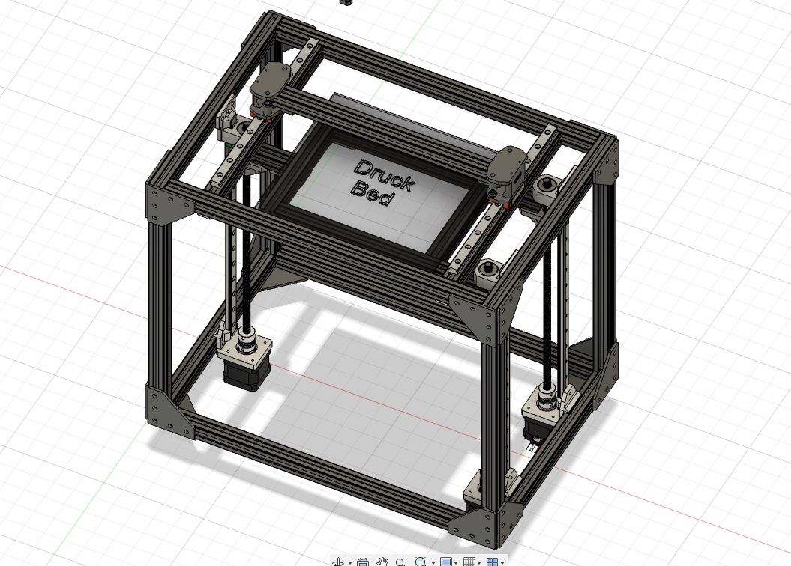

**Total time spent: 39hrs**

# June 15th - Planning the concept (0.5hrs)

After I had a rough idea of ​​what I wanted to build, I wrote down my ideas. The goal is to design an inexpensive and simple CoreXY printer and construct it so that the print head can be replaced with a laser. I've had this idea for a few months now and am now taking this opportunity to implement it. The printer should be usable with and without an enclosure.

- Aluminum frame (2020)
- CoreXY
- should be easily scalable
- swapable toolheads (FDM and Laser)
- autoleveling
- emergency stop
- full enclosure
- Nema 17 Motors if possible

# June 15th - Frame and Z-Axis (10hrs)

I learned from YouTube how a typical CoreXY printer is constructed. Then I started designing in Fusion360. After the frame, I continued with the Z-axis. In my mind, this design should work well and print semi-well (i am learning cad with this project). The system uses a trapezoidal lead screw and the corresponding TR8x4 trapezoidal lead nut to move the Z-axis up and down, attached to linear guides. Nema 17 motors are used because they are inexpensive in my area.

A 3D printed holder is screwed into the aluminum extrusion at all three points at the top. The linear rail is then attached to this holder. Another holder is screwed on and fitted with a ball bearing so that the trapezoidal lead screw is held and can rotate freely.

Below, a 3D-printed holder is screwed to the aluminum extrusion where the linear rail and motor are attached. The trapezoidal lead screw is attached to the motor via a 5mm to 8mm coupling, and the weight is distributed across the motor housing via a ball bearing with a washer to prevent excessive strain on the shaft. On the carriage, which sits on the linear rail, there is another 3D-printed holder that holds the trapezoidal lead screw nut and onto which the aluminum extrusion frame is screwed, upon which the print bed is then placed.

The aluminum extrusion frame for the print bed is held together with simple 3D printed plates.

# June 18th - XY-Axis (6.5hrs)

After a few school exams, I was finally able to move on to the remaining axes. The Y-axis already has two linear rails, and I've finished the 3D-printed mounts. These include space for screwing the two idler pulleys at two different heights for the two belt loops. I also learned today how the corexy system works exactly; YouTube was my best source of help.

The entire CAD project looks like this so far.

# June 22th - XY-Axis finis, learning and PrintHead (11.5hrs)

I've finally finished the end pieces for the XY axis. The middle plate holder is only loosely attached and, as mentioned, serves only as an intermediate piece to adjust the two idler pulleys to the correct distance. They've become a bit bulkier, but I think that gives the whole thing more stability and hopefully they will be easy to 3D print.

Next come the motor mounts, which are very simply made. You screw the NEMA 17 motor to the upper U-shaped part and attach it to the base plate. Now, with a bit of fiddling, you need to attach the base plate to the aluminum extrusions. Finally, you can screw the pulley to the motor shaft.

And now the XY axis looks like this. The Y axis needs to be adjusted because I didn't make any provision for leveling the print bed. So, I'll make the previously designed guides with linear rails at all four corners and add joints at all four corners to level the bed. Similar to a 5-axis 3D printer design.

I've decided against the simple Creality CR10S extruder or the similar Ender 3 extruder. For direct extrusion, I'll use the dual gear BMG extruder or a cheap clone to minimize overall costs. I'll attach any NEMA 17 motor that's no longer than 48 centimeters to it, so I can enclose the printer later. With a small adapter, I can use the Bambu X1C hotend. For the electronics, I'd like to use a small control board on the print head, but I don't yet know how complicated that would be.

# July 5th - Printhead Mount and Printbed Redesign (9hrs)

After another exam period, I finally got back to work on this project. First, I modeled an adapter for the Bambu Lab hotend to mount it on the V6 universal mount.

Next, I modeled a simple printhead mount to attach the existing components. This is screwed to the top of the linear guide carriage and runs around the entire x-axis to ensure stability. A counterplate is then screwed on from the other side, completing the basic system for mounting the print head.

Next, I finally finished the print bed. It's attached to four corners with M5 ball joints, allowing the print bed to be adjusted at different heights. This allows for auto-leveling of the printer. Simple adapters are attached to the ball joints, which can be adjusted depending on the printbed size. It's important that the printbed is a combination with an aluminum plate; the plate can be attached to the adapter with clamps. The material should be at least ASA for heat resistance.

I also added another motor with a linear rail and carriage to implement the aforementioned bed leveling. The base frame made of aluminum extrusions was also slightly adjusted in width so that the printhead can reach all corners of the print bed and also to ensure the mobility of the Z-axis. I also decided against my wish to have a small circuit board on the print head to minimize cables, as I don't have enough time for it, and the main board to control the printer, including the motors, sensors, fans, and hotend, and to communicate with Klipper, is currently only in the planning stages.

# July 6th - Printhead and finally feet! (4.5hrs)

Finally, the printer has feet to stand on. On my to-do list for the final design changes is the enclosure for printing materials like ABS and ASA, and, more importantly, for using a slightly more powerful laser. The mount and laser will be modeled and selected based on the controller PCB design, as the 3D printer concept needs to be finalized first.

The final changes to the printheat are complete. Now there's a BL touch sensor for auto-leveling and, of course, the parts cooling fan with a somewhat awkward mount so that the aluminum extrusions don't get in the way and the print head can reach everywhere. Two stoppers are attached to the ends of the linear rail to hold the linear rail carriage at the ends.

Here are some CAD images for the new x-axis system and the bed in combination with the finished printhead.

Here it is again in combination with the aluminum frame and the feet, which of course have the name of the project engraved on them.

And finally, the basic design of the 3D printer is complete. Now it's time to design the motherboard for the printer. Next comes the laser selection and the modeling of the mount and enclosure. I actually wanted to finish this project a long time ago, but I don't have as much time as I thought. I'd like to realize other projects, but time is, as always, the issue.

# July 15th - Error correction (1.5hrs)

I took another look at the design and realized that there was no way to attach the belt to the printhead. That's now there, too, albeit a bit impractical.

I'll also be using two SKR Mini E3 V3 controller boards to operate the printer with Klipper. I've started making my own 3D printer controller, but that will be implemented in a future project. I'm aware that I'm currently way over budget, but I already have some expensive parts that can be used for the printer. For cost reasons, the laser won't be implemented for now, although it's certainly possible. I will ship the project now because highway is slowly coming to an end, if I have time again I will enclose the printer.