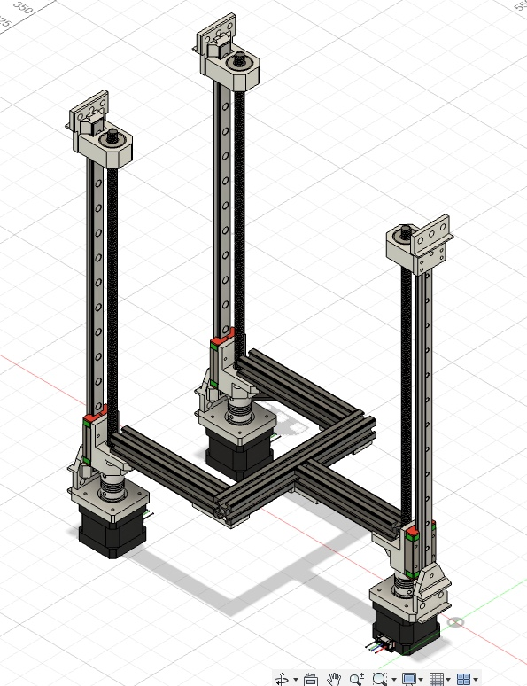
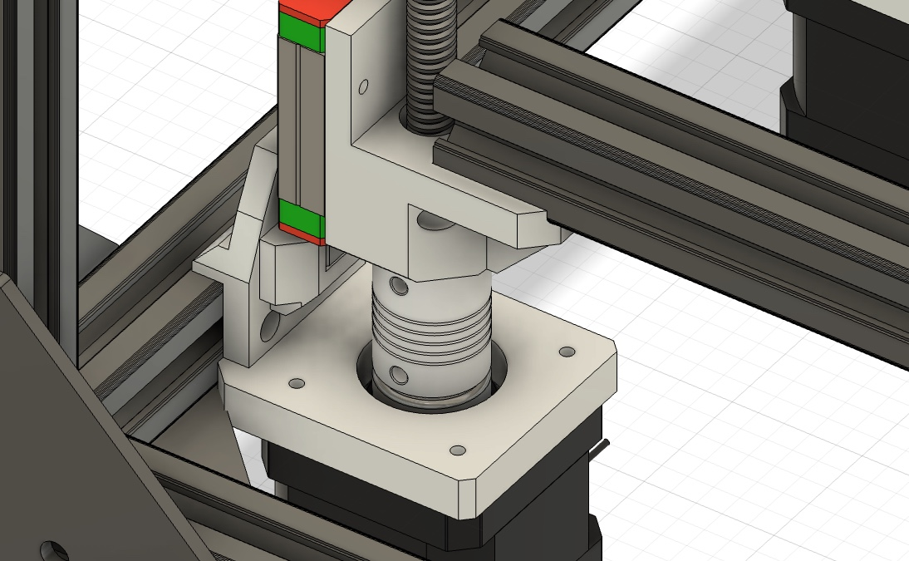

**Total time spent: 10.5hrs**

# June 15th - Planning the concept (0.5hrs)

After I had a rough idea of ​​what I wanted to build, I wrote down my ideas. The goal is to design an inexpensive and simple CoreXY printer and construct it so that the print head can be replaced with a laser. I've had this idea for a few months now and am now taking this opportunity to implement it. The printer should be usable with and without an enclosure.

- Aluminum frame (2020)
- CoreXY
- should be easily scalable
- swapable toolheads (FDM and Laser)
- autoleveling
- emergency stop
- full enclosure
- Nema 17 Motors if possible

# June 15th - Frame and Z-Axis (10hrs)

I learned from YouTube how a typical CoreXY printer is constructed. Then I started designing in Fusion360. After the frame, I continued with the Z-axis. In my mind, this design should work well and print semi-well (i am learning cad with this project). The system uses a trapezoidal lead screw and the corresponding TR8x4 trapezoidal lead nut to move the Z-axis up and down, attached to linear guides. Nema 17 motors are used because they are inexpensive in my area.

A 3D printed holder is screwed into the aluminum extrusion at all three points at the top. The linear rail is then attached to this holder. Another holder is screwed on and fitted with a ball bearing so that the trapezoidal lead screw is held and can rotate freely.

Below, a 3D-printed holder is screwed to the aluminum extrusion where the linear rail and motor are attached. The trapezoidal lead screw is attached to the motor via a 5mm to 8mm coupling, and the weight is distributed across the motor housing via a ball bearing with a washer to prevent excessive strain on the shaft. On the carriage, which sits on the linear rail, there is another 3D-printed holder that holds the trapezoidal lead screw nut and onto which the aluminum extrusion frame is screwed, upon which the print bed is then placed.

The aluminum extrusion frame for the print bed is held together with simple 3D printed plates.

